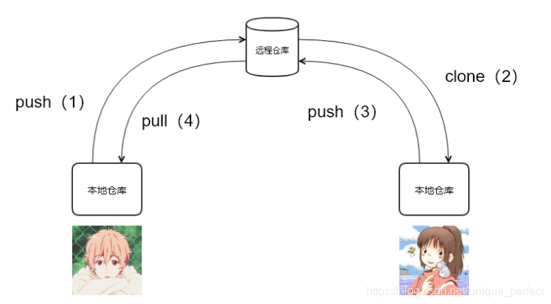
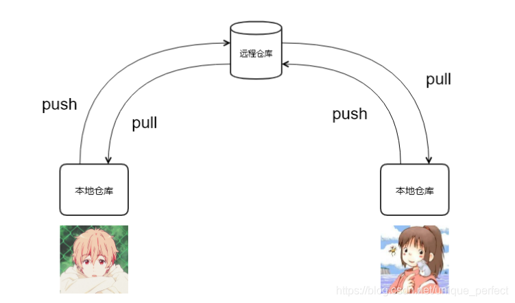
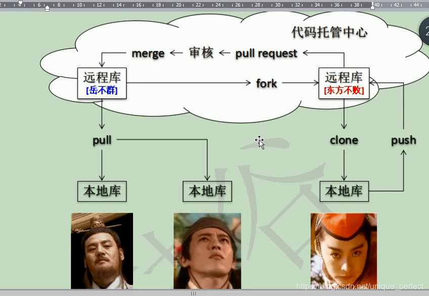
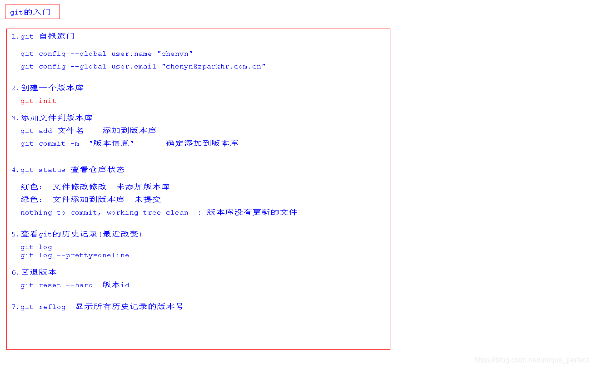
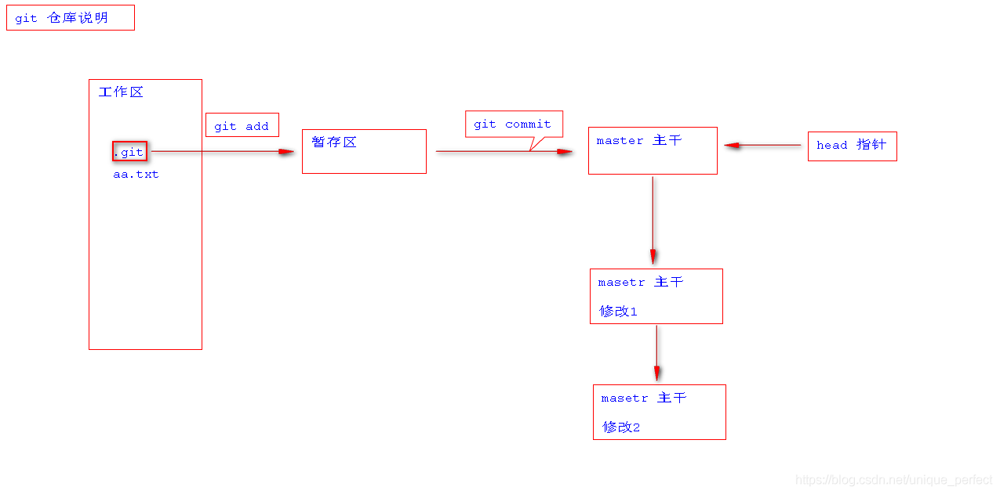
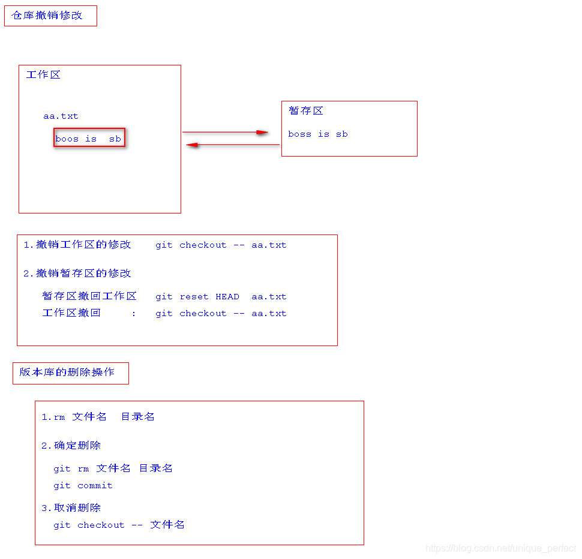
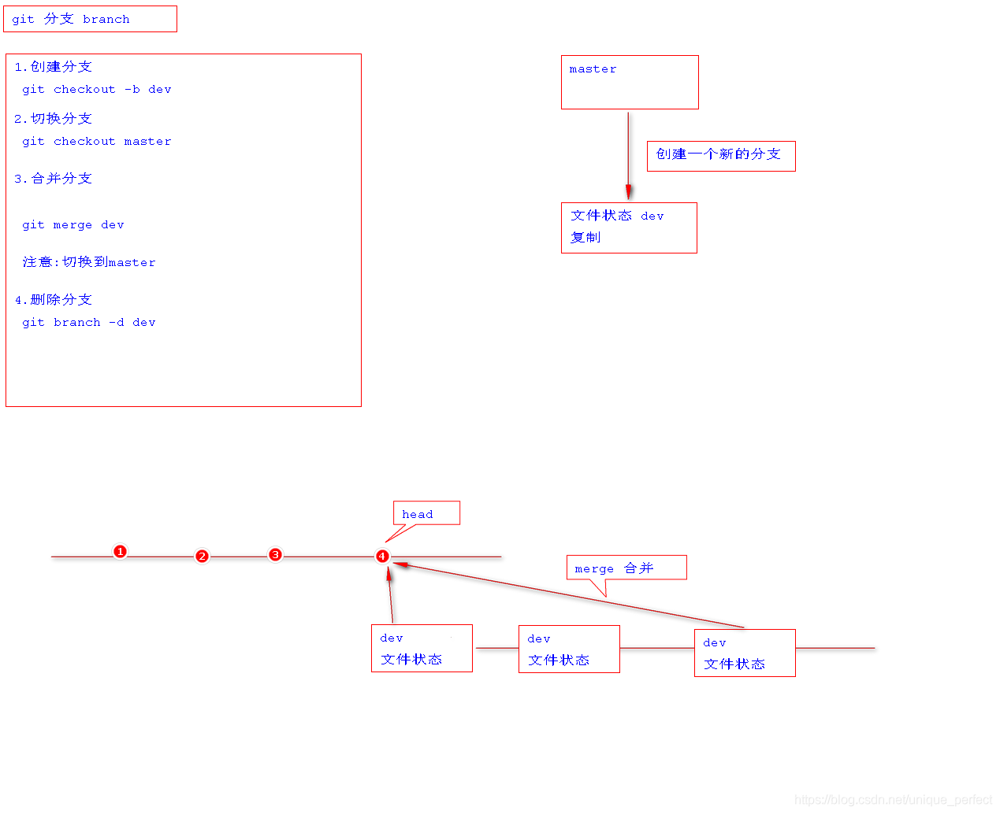
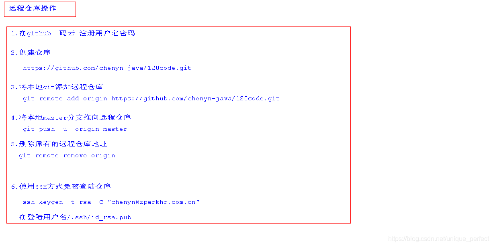
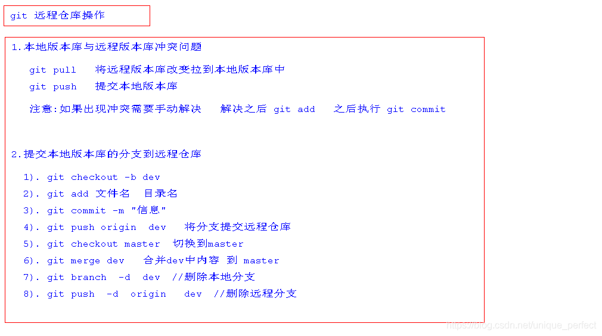
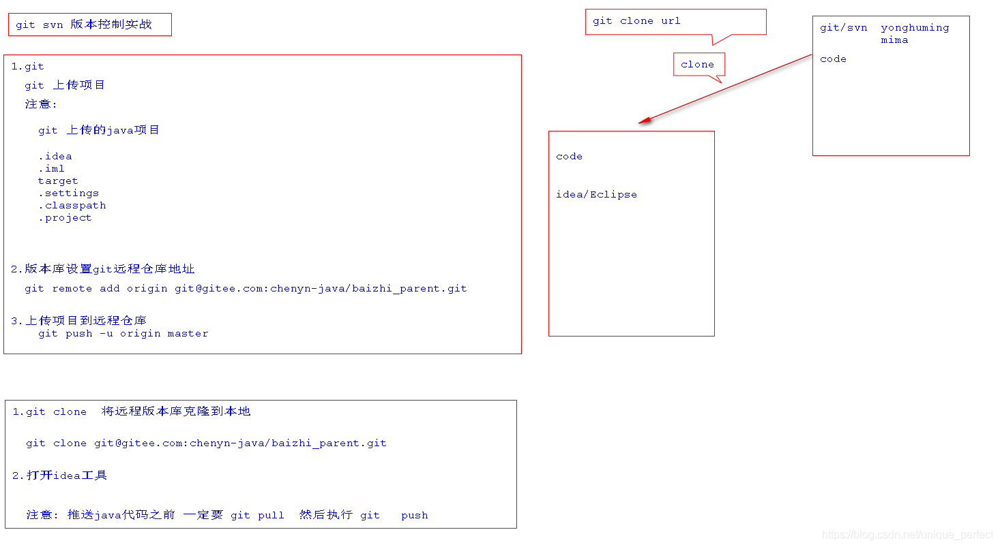

# git知识点笔记

## 知识点

### 1.1 Git

Git是一个版本管理控制系统（缩写VCS），它可以在任何时间点，
将文档的状态作为更新记录保存起来，也可以在任何时间点，
将更新记录恢复回来。

### 1.2 查看Git的版本

git --verson

### 1.3 Git 基本工作流程

```java
    git仓库	          暂存区	           工作目录
用于存放提交记录	临时存放被修改文件	被Git管理的项目目录
```

### 1.4 Git 使用前配置

在使用 git 前，需要告诉 git 你是谁，在向 git 仓库中提
交时需要用到。

1. 配置提交人姓名：git config --global user.name “提交人姓名” # (对当前系统用户有效)
2. 配置提交人姓名：git config --global user.email  “提交人邮箱” # (对当前系统用户有效)
作用：识别开发人员，与登良github的账户无关
3. 查看git配置信息：git config --list

注意
1.如果要对配置信息进行修改，重复上述命令即可。
2. 配置只需要执行一次。

### 1.5常用提交步骤

1 git init  # 初始化git仓库

2 git status  # 查看文件状态

3 git add 文件列表 # 追踪文件

4 git commit -m  “提交信息”  # 向仓库中提交代码(全部文件)
vs： git commit -m "提交信息"  文件  # 提交某个文件

5 git log # 显示所有提交记录
vs： git log --pretty=oneline   # 一行显示版本信息
补充：
git log lfa380b5O2a0Ob82bfc8d84c5ab5el5b8fbf7dac # 会显示所有关于这个id以及之前的修改记录
git log lfa380b5O2a0Ob82bfc8d84c5ab5el5b8fbf7dac -1 # 加上-1参数表示我们只想看到一行记录
而如果想要查看这条提交记录具体修改了什么内容，可以在命令中加入p参数，命令如下:
git log Ifa380b502a00b82bfc8d84c5ab5el5b8fbf7dac -1 -p

6 git reset  --hard 版本id  # 回退版本

7 git reflog   # 查看所有版本信息

8 git diff  # 表示未使用add命令时的修改

这样可以查看到所有文件的更改内容，
如果你只想查看MainActivity.java这个文件的更改内容，
可以使用如下命令：
git diff app/src/main/java/com/example/providertest/MainActivity.java

vs：git log 表示最近的改变，git reflog可以看到所有的改变
如果文件未被跟踪,即没有使用git add这个命令时,文
件为红色,如果使用这个命令,则文件变为绿色.
<hr>

### 1.6 撤销

1 git checkout 文件
不过这种撤销方式只适用于那些还没有执行过add命令
的文件,如果某个文件已经被添加过了，这种方式就无
法撤销其更改的内容.
这种情况我们应该先对其取消添加，然后才可以撤回提交。
取消添加使用的是reset命令，用法如下所示：
git reset HEAD app/src/main/java/com/example/providertest/MainActivity.java
然后再运行一遍git status命令，你就会发现MainActivity.java这个文件重新变回了未添加状态，此时就可以使用checkout命令来将修改的内容进行撤销了。

2 用暂存区中的文件覆盖工作目录中的文件： git checkout 文件
应用场景:如果开发过程中不满意当前的内容,想要后悔药,那么可以
使用这个命令从暂存区取相应的文件来恢复,使用后文件的状态依然
为绿色.

3 将文件从暂存区中删除： git rm --cached 文件
应用场景:开发过程中,不是每个文件都是有必要交给git管
理的,使用这个命令可以从暂存区删除没用的文件,不交
给git管理,此时文件在工作目录依然存在,只是没在
暂存区而已.

4 将 git 仓库中指定的更新记录恢复出来，并且覆盖暂存区和工
作目录：git reset --hard commitID
应用场景:开发过程中,如果想要利用某次记录覆盖暂存区和工
作目录,则可以使用 上面那个命令.

### 1.7 分支

#### 分支介绍

为了便于理解，大家暂时可以认为分支就是当前工作目
录中代码的一份副本。
使用分支，可以让我们从开发主线上分离
出来，以免影响开发主线。

#### 分支细节

主分支（master）：第一次向 git 仓库中提交更新记录时自动
产生的一个分支。
开发分支（develop）：作为开发的分支，基于 master 分支创建。
功能分支（feature）：作为开发具体功能的分支，基于开发分支创建
功能分支 -> 开发分支 -> 主分支
解析:实际开发中,主分支一般来发布源码之类,要保持稳定,所以
就出现了开发分支,当开发分支弄好后在合并到主分支.
功能分支是作为开发具体功能的分支,为了保持开发分支
的稳定,当功能分支弄好后在合并到开发分支.所以路线就是
功能分支 -> 开发分支 -> 主分支

#### 分支命令

git branch  # 查看分支

git branch 分支名称 # 创建分支

git checkout 分支名称  # 切换分支
注意:在切换分支的时候一定要保证当前的内容处于提
交状态,即有使用git commit这个命令,否则切换到其
他分支的时候会把切换前的分支内容带过去,这不是我们想要的

git merge 来源分支 # 合并分支

git branch -d 分支名称` # 删除分支（分支被合并后才允许删除）（-D 强制删除）
注意:如果某分支没有合并，则该分支不可以直接被删除，解决办法就是把小d改为大D即可。

#### 暂时保存更改

在git中，可以暂时提取分支上所有的改动并存储，让开发人
员得到一个干净的工作副本，临时转向其他工作。
使用场景：分支临时切换
存储临时改动：git stash
恢复改动：git stash pop

>应用场景(分支临时切换);开发过程中，如果老板说以前的内容存在bug，那么你得切换分支去修改，但你当前的分支尚未完成，不想提交上去.即不要git commit这个命令的需求，但是又不想把切换前的分支内容带过去，此时可以利用git stash(存储临时改动)这个命令，这个命令的作用就是把你当前分支的内容剪切到剪贴板上，然后就可以切换分支了，虽然没有git commit这个命令，但状态已处于工作清空状态（即暂存区跟工作目录没有内容了）。当处理好bug之后切换到原来的分支，使用git stash pop(恢复改动)这个命令从剪贴板复制过来，此时又恢复之前的状态了。

### 1.8 github

在版本控制系统中，大约90%的操作都是在本地
仓库中进行的：暂存，提交，查看状态或者历史
记录等等。除此之外，如果仅仅只有你一个人在
这个项目里工作，你永远没有机会需要设置一个远程仓库。

只有当你需要和你的开发团队共享数据时，设置一
个远程仓库才有意义。你可以把它想象成一个
“文件管理服务器”，利用这个服务器可以与开发
团队的其他成员进行数据交换。

仓库(Repository)
有多少个开源项目，就有多少个仓库

收藏(Star)
即收藏人数

fork(克隆)
复制项目到自己的仓库

pull request
请求把改变的内容更改到被克隆的那个远程仓库中

watch(关注)
通知你关注项目的改变

issue(事务卡片)
发现bug，把bug通知上去，讨论协商

### 1.9 多人协作开发流程

同队开发
一开始:

A在自己的计算机中创建本地仓库
A在github中创建远程仓库
A将本地仓库推送到远程仓库
B克隆远程仓库到本地进行开发
B将本地仓库中开发的内容推送到远程仓库
A将远程仓库中的最新内容拉去到本地
后来:


### 2.0 跨团队合作开发



#### 同队开发

1.首先A方创建远程仓库，将本地仓库推送到远程仓库
（我们本地仓库的版本必须大于远程仓库的版本，否则push失败。），
采用git push 远程仓库地址 分支名称。
git push https://github.com/yxjgithub-png/git-demo.git master # 将master分支推送到远程仓库。但是这里地址麻烦，可以采用步骤2添加别名

2. git remote add 远程仓库地址别名(可以自定义,一般为origin)  远程仓库地址 # (查看当前远程地址的别名
git remote -v )
git remote add origin https://github.com/yxjgithub-png/git-demo.git # 如果不想使用地址形式，可以采用别名来代替。如果想直接使用git push，则可以采用步骤3

3. git push -u 远程仓库地址别名 分支名称
git push origin master  # 推送远程分支
git push -u origin master # -u 记住推送地址及分支，下次推送只需要输入git push即可.B方想加入团队进行开发，则需要步骤4.
解析：第一次输入需要用户名和密码，以后不用，window系统会帮助我们记住用户名和密码，在那个控制面板的凭据管理器中。

4.git clone 仓库地址 
git clone 远程仓库地。B方想推送自己修改的内容，则需要步骤5
效果:1.下载内容到本地 2.克隆别人远程仓库的别名 3.初始化仓库

当我们需要clone后想把内容推送到别人的远程仓库时，不可以直接推送，而是需要别人在相应的远程仓库的settings里面操作，填写邀请队友的账号。当我们用git clone的时候，不仅将对方的东西复制过来，而且连对方远程仓库的别名也复制过来。
5. git push 远程仓库地址 推送的分支
git push origin master  # B方想把内容推送给A方，然后A方可以采用步骤6进行版本的更新

git push <远程主机名>  <本地分支名>:<远程分支名>
注意，分支推送顺序的写法是<来源地>:<目的地>，所以git pull是<远程分支>:<本地分支>，而git push是<本地分支>:<远程分支>。如果省略远程分支名，则表示将本地分支推送与之存在”追踪关系”的远程分支(通常两者同名)，如果该远程分支不存在，则会被新建。


6.git pull
拉取远程仓库中最新的版本：git pull 远程仓库地址 远程地址分支名称
git pull origin master # 拉取origin主机的master分支，与本地当前分支合并

比如，要取回origin主机的next分支，与本地的master分支合并，需要写成下面这样   git pull origin next:master
如果远程分支(next)要与当前分支合并，则冒号后面的部分可以省略。上面命令可以简写为：git pull origin next


git clone 跟 git pull的区别
git clone是在没有本地仓库的基础上clone别人的东西，而git pull则是在有本地仓库的基础上拉取代码到本地。git clone
只是第一次参与开发时用，以后都是用git pull命令

解决冲突
在多人同时开发一个项目时，如果两个人修改了同一个文件的同一个地方，就会发生冲突。冲突需要人为解决。
先把远程仓库pull下来，然后删除冲突的标记，再做相应的修改即可。然后git add，git commit，git push上去。

#### 跨团队协作

1. 程序员 C fork仓库：把对方远程仓库的内容复制到自己的远程仓库
2. 程序员 C 将远程仓库克隆在本地进行修改
3. 程序员 C 将仓库推送到自己的远程仓库
4. 程序员 C如果想要把修改内容发给对方，则需要点击pull request命令
5. 然后等待原远程仓库作者审核
6. 原远程仓库作者合并代码即可

### 2.1 GIT忽略清单

将不需要被git管理的文件名字添加到.gitignore中，
在执行git命令的时候，git就会忽略这些文件。
将工作目录中的文件全部添加到暂存区：git add .

### 2.2 Github搜索技巧

in:name Vue # 搜索项目名包含Vue的项目
in:name Vue  stars:>5000 # 搜索Vue项目的star数大于5000 
in:name Vue stars:>5000 forks:>5000 # 搜索Vue项目的star数大于5000 并且 forks:>5000
in:readme Vue # 搜索README.md里面包含Vue的项目
in:descrition Vue # 搜索项目描述包含Vue的项目
language:java  # 搜索语言为java的项目
pushed:>2020-01-02 # 搜索项目最后更新时间大于2020-01-02的项目

## 常见错误

### idea提交项目到github提交到远程库错误:Push to origin/master was rejected

解决方案：git pull origin(远程仓库的地址) master --allow-unrelated-histories

### git pull遇到错误：error: Your local changes to the following files would be overwritten by merge

>为什么会在拉取的时候出现这个错误呢：
> 分为四种情况
> 1.本地代码没动，gitee上面的代码更改了（此时pull会将本地代码更新成代码服务器的代码）
> 2.本地代码没动，gitee上面没动（不会有任何冲突）
> 3.本地代码动了，gitee上面没动 （不会冲突，本地代码也不会被gitee上面的代码所改变）
> 4.本地代码动力，gitee上面动力同样的代码（发生冲突，因为本地代码修改了，gitee修改了同样的代码，校验不通过）

**处理办法**
场景：因为有事情需回到学校搞毕设，同事在公司说接口代码有问题，需要修改；
我用笔记本把代码同步到笔记本，然后做了一些修改、提交。修改完成。
第二天我来到公司（公司里用台式机，不是自己的笔记本），忘了先git pull到本地之后，直接在台式机上的代码进行编写，突然想起忘了pull了，然后想用git pull来更新本地代码。结果报错：error: Your local changes to the following files would be overwritten by merge:
意思是我台式机上新修改的代码的文件，将会被git服务器上的代码覆盖；我当然不想刚刚写的代码被覆盖掉，看了git的手册，发现可以这样解决：
方法1：如果你想保留刚才本地修改的代码，并把git服务器上的代码pull到本地（本地刚才修改的代码将会被暂时封存起来）
git stash
git pull origin master
git stash pop
如此一来，服务器上的代码更新到了本地，而且你本地修改的代码也没有被覆盖，之后使用add，commit，push 命令即可更新本地代码到服务器了。
<hr>
方法2、如果你想完全地覆盖本地的代码，只保留服务器端代码，则直接回退到上一个版本，再进行pull：
git reset --hard
git pull origin master
注：其中origin master表示git的主分支。

### 用于git上传的ssh公钥私钥

生成秘钥：ssh-keygen
秘钥存储目录：C:\Users\用户\\.ssh
公钥名称：id_rsa.pub
私钥名称：id_rsa
解析：使用ssh-keygen命令，然后生成秘钥，私钥
保存在自己的电脑中，公钥发布在自己的远程仓库
中（在settings中找到设置ssh的地方，将公钥的
内容复制到那里），然后复制相应仓库的ssh地址，
然后正常操作就可以实现免密码登录。

我们如果项目克隆方式是ssh方式进行克隆（和后续的代码提交）我们需要在gitee和github上面设置自己的ssh的公钥。当新电脑配置新的公私钥的时（建议直接使用复制久电脑的sshkey 这样就可以避免大量git配置项重配，包括服务器里面的用于git的key）如果我们通过git克隆下来的ssh公私key我们需要更换空格模式（因为使用git时他会自动的把lf换成lfef导致异常）。

> 服务器中的sshkey
>
> 服务器有两种访问方式
>
> 1. 通过密码进行访问：但是此访问方法很危险。在后续配置好ssh钥后将取消这种访问方式。
>
> 2. 通过sshkey访问：由服务器生成公key然后通过putty生成私key然后选择私key位置。将公私key进行绑定这样就能够就能够直接访问服务器（私key一定不能掉，否则整个服务器只能进行重置。）
>
> 这里的sshkey是为了在访问服务器的时候来权限是否有权限。

## 图片总结







