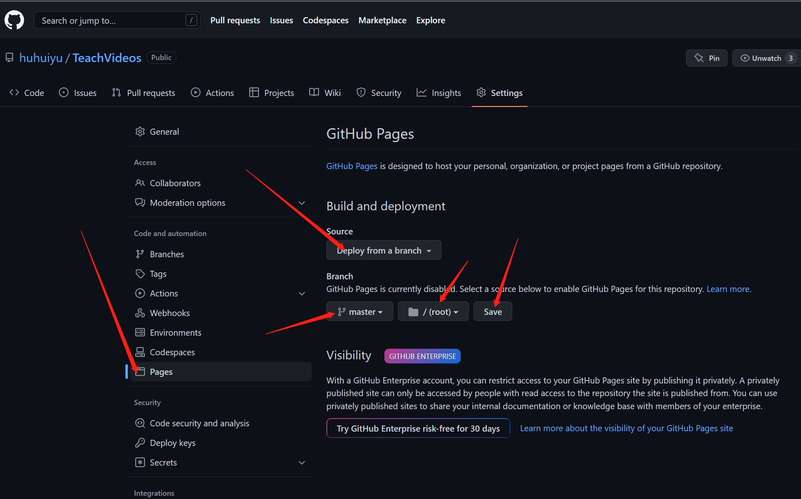
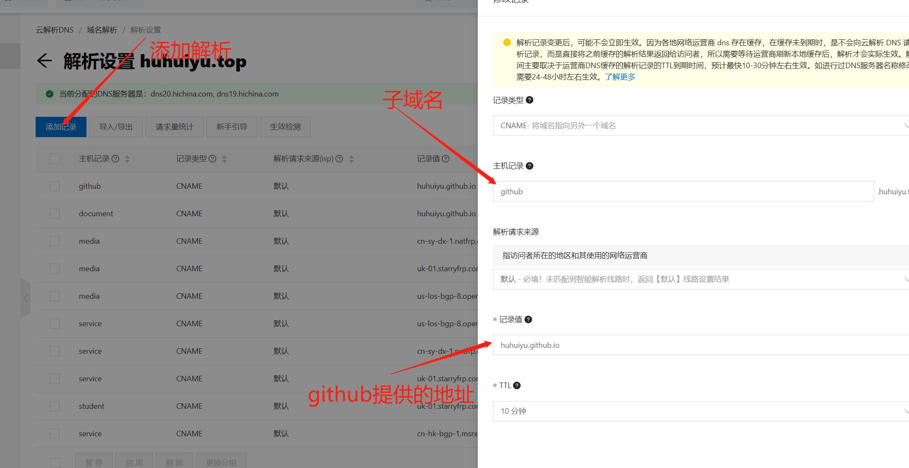
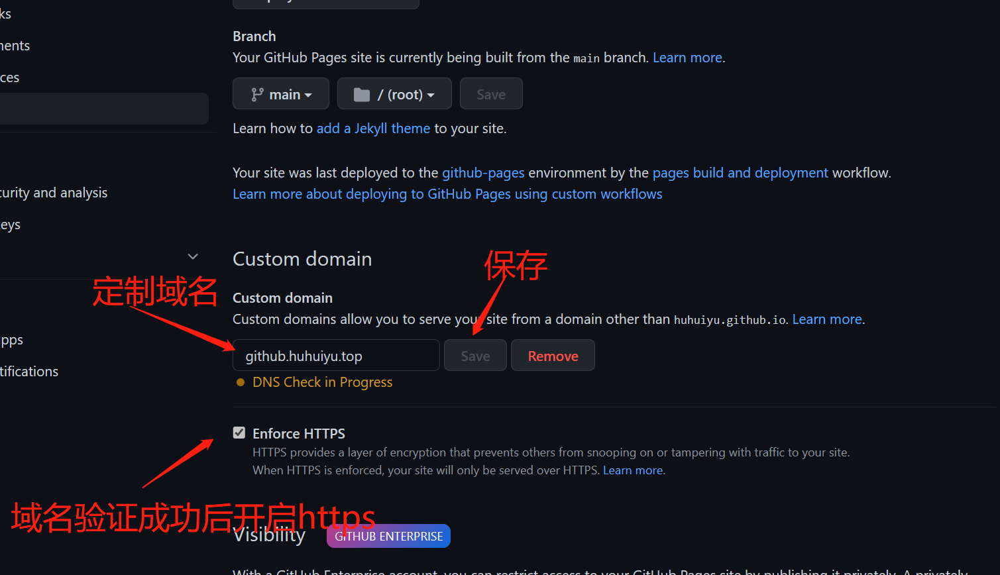

# github额外配置

## pages配置(实现在二级域名下，完成对github项目的访问)

0. 需求：用于自己的域名（这样才能通过DNS解析 例子：chengbelief.top）
1. 申请自己域名的二级证书(note.chengbelief.top)
2. 在github中创建一个仓库（可以同名）：注意此仓库必须为public 如果是私有需要额外收费。
3. 在github仓库中将自己的二级申请的ssl证书放入到根目录中（这样可以通过https协议进行访问）
4. 配置pages信息

5.为此二级域名添加对应的域名解析

此时github提供的地址就为pages页面的需要进行绑定的记录值相同而不是自己的全域名
6.选择定制绑定的域名（上面绑定记录值则是此图中的huhuiyu.top.io）

7.开启https访问
8.最后拉取一下项目，然后将我们的笔记放入对应仓库的文件夹中最后上传即可。

## git/相对路径访问问题

和普通普通的文件管理一样 但是记得在gitee中需要分级管理需要从/开始不能使用相对定位。
在githup上面则不会有此烦恼
