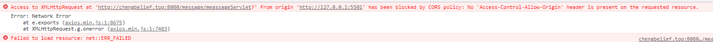

# javaWeb

## [返回首页](/README.md)

### [全新javaweb笔记](http://heavy_code_industry.gitee.io/code_heavy_industry/pro001-javaweb/lecture/)

* [在调用使用前端vue时 出现跨域问题](#kuayu)
* [对web容器 javaWeb容器 Servlet容器的理解](#rongqi)
* [请求头三种不同方式请求后台如何处理](#requset)
* [响应头三种不同方式请求前端如何处理](#respon)
* [为什么post请求通过前端axios获得数据](https://cloud.tencent.com/developer/article/1709763)
* [后端递交json字符串到前端会自动解析成json对象](https://ask.csdn.net/questions/7421847)
* [session原理](https://blog.csdn.net/weixin_42217767/article/details/92760353)
* [为什么ajax请求中 servlet中的所有转发或者重定向都无效](https://blog.csdn.net/qq_40274351/article/details/80643645)
* [javaWeb所有路径全部知识总结](#url)
* [javaweb打包成war包可能遇到的问题](#packge)
<hr>

### 跨域问题(此方法只适合javaweb项目使用)

在springboot中使用此方法。由注入过滤器的方式来处理跨域问题。在服务器中的tomcat8会出现无权限访问的问题(tomcat9中又无事发生) 但我们使用springboot项目就应该采取springboot的方式去处理跨域问题（如拦截器）

<span id=kuayu> 让后端在 服务器上跑起来 通过vue在前端调用接口 结果出现</span>


出错原因  
>
解决方案多种多样。up说的一句话很不对，”跨域是前端的问题”。跨域一定是后端的问题，如果前端能解决，那这个机制就没存在的意义了。不能因为前端代码运行在浏览器就认为浏览器属于前端。讲跨域首先要讲Ajax，只有Ajax才存在跨域问题。http，https可不管来源是什么域的。一个form表单跨域请求，他会直接去到别人服务器上。本质上这就不是跨越了。是用户可感知的，不需要验证域（也没有任何机制和权限验证）。一个ajax请求（当今的前端都是ajax请求），是用户无感知的，无声无息的请求。这个服务器必须不能开启跨域，才能拒绝跨域的ajax请求，控制权在服务器，验证者是浏览器，没前端的事。这个跨域的配置都是必须是开发环境的，或者完全开放的api。99%的生产环境都不能开启跨域。csrf也是和跨域有很大关联的，如果你开启跨域，你的csrf的验证往往都是没有任何意义的。csrf就是钓鱼网站向真实网站发起一次非ajax页面级http请求，如果真实环境开启了跨域，这次csrf攻击的http可以通过ajax接口大概率获取各种csrf验证的参数。如果生产环境开启跨域，钓鱼网站就可以向真实网站发起大量ajax请求，这些请求挟带的cookie是浏览器的自动行为，访问钓鱼网站的用户就被黑了。

目前解决办法：不要在前端解决 主要是后端的接口问题 可以在过滤器处理调此问题 （这样回导致服务器不安全）

``` java
        // 指示的请求的响应是否可以暴露于该页面。当true值返回时它可以被暴露
       resp.setHeader   ("Access-Control-Allow-Credentials","false");
        //设置受支持请求标头
        resp.setHeader("Access-Control-Allow-Headers","*");
        //响应标头指定响应访问所述资源到时允许的一种或多种方法
        resp.setHeader("Access-Control-Allow-Methods","*");
          // 响应标头指定 指定可以访问资源的URI路径
        resp.setHeader("Access-Control-Allow-Origin","*");
        //设置 缓存可以生存的最大秒数
        response.setHeader("Access-Control-Max-Age", "3600");
```

补充 : 在当http请求 https 的数据时不会出现异常 而当 https 请求 http的数据时 会出现异常(因为 https 支持 ssh 安全协议 相当于安全)<br>

***  终极处理方式：nginx做了反向代理 加了允许跨域的请求头  ***

<hr>

### 容器理解

如果需要把数据回显 可以使用 th:field 属性来做到单选框的回显
<span id=rongqi> web容器 javaWeb容器 Servlet容器的理解</span>

> web容器
> 静态页面(指没有数据而不是指没有js)我们平时跑的所有的静态页面如html、css等 我们都是在web容器跑的
> servlet容器 == javaweb容器
> jsp是通过servlet容器输出 本质上jsp就是一个servlet 且servlet容器包括web容器 可以通过servlet容器输出html页面 但是用servlet容器使出静态页面效率极其低下 输出jsp的效率是静态页面的6倍

<hr>

### <span id=axios>axios提交数据的一些情况详解</span>

1 ：响应情况 当我们后端写出一个JSON字符串 在前端会变成JSON对象是因为在axios声明中出现了
// `responseType` 表示浏览器将要响应的数据类型
  // 选项包括: 'arraybuffer', 'document', 'json', 'text', 'stream'
  // 浏览器专属：'blob'
  responseType: 'json', // 默认值
所以会将我们的JSON字符串默认帮我们变成JSON格式

**并且会将我们响应头默认的变成application/json;charset=UTF-8 如果后端做了规定则以后端规定为主**

2:响应数据情况 axios会自动帮我们封装入状态码等会随着下面这些数据变成response  如果需要获取请单独获取

``` java
  {
  // `data` 由服务器提供的响应
  data: {},

  // `status` 来自服务器响应的 HTTP 状态码
  status: 200,

  // `statusText` 来自服务器响应的 HTTP 状态信息
  statusText: 'OK',

  // `headers` 是服务器响应头
  // 所有的 header 名称都是小写，而且可以使用方括号语法访问
  // 例如: `response.headers['content-type']`
  headers: {},

  // `config` 是 `axios` 请求的配置信息
  config: {},

  // `request` 是生成此响应的请求
  // 在node.js中它是最后一个ClientRequest实例 (in redirects)，
  // 在浏览器中则是 XMLHttpRequest 实例
  request: {}
}
```

3：请求情况 我们通过axios技术提交数据如果采用的data参数(会将我们的参数格式从Content-Type: application/x-www-form-urlencoded 变成 Content-Type: application/json )
处理方法 我们需要通过将我们的data在上传之前通过Qs技术将上传的数据变成Content-Type: application/x-www-form-urlencoded 技术

4:请求情况 我们通过axios技术提交数据如果采用的params参数 我们会将参数将自动拼接到url后面所以我们就能正常的获取通过getParameter(key)获取参数

<hr>

### <span id=requset>请求头三种不同方式请求后台如何处理</span>

#### 1:Content-Type: application/json

设置请求头 数据类型为JSON  （axios使用data属性传递参数会自动帮你转换成json格式）
后端处理：不能直接通过getParameter(key)直接获取 
后端如果需要处理这种请求获取参数

``` java
 因为前台提交的数据格式为json格式 所以通过获取流的形式获取采取拼接字符串的格式
// 1.由于请求体数据有可能很大，所以Servlet标准在设计API的时候要求我们通过输入流来读取
    BufferedReader reader = request.getReader();

    // 2.创建StringBuilder对象来累加存储从请求体中读取到的每一行
    StringBuilder builder = new StringBuilder();

    // 3.声明临时变量
    String bufferStr = null;

    // 4.循环读取
    while((bufferStr = reader.readLine()) != null) {
        builder.append(bufferStr);
    }

    // 5.关闭流
    reader.close();

    // 6.累加的结果就是整个请求体
    String requestBody = builder.toString();

    // 7.创建Gson对象用于解析JSON字符串
    Gson gson = new Gson();

    // 8.将JSON字符串还原为Java对象
    Student student = gson.fromJson(requestBody, Student.class);
    System.out.println("student = " + student);
```

#### 2:Content-Type: application/x-www-form-urlencoded

设置请求头 数据类型为默认格式
后端处理：可以直接通过getParameter(key)直接获取 并且mvc底层全部通过此方式获取参数
额外补充：
>而在使用POST时对应的传参使用的是data，data是作为请求体发送的，同样使用这种形式的还有PUT,PATCH等请求方式。有一点需要注意的是，axios中POST的默认请求体类型为Content-Type:application/json（JSON规范流行），这也是最常见的请求体类型，也就是说使用的是序列化后的json格式字符串来传递参数，如：{ "name" : "mike", "sex" : "male" }；同时，后台必须要以支持@RequestBody的形式接收参数，否则会出现前台传参正确，后台接收不到的情况。
>如果想要设置类型为Content-Type:application/x-www-form-urlencoded（浏览器原生支持），可以用qs这个库来格式化数据。默认情况下在安装完axios后就可以使用qs库。

#### 3：'Content-Type': 'multipart/form-data'

如果前端希望将文件上传到后端。前端需要完成

1. 在请求头中设置Content-Type': 'multipart/form-data‘  

2. 修改请求体。我们平时上传数据都是通过Content-Type: application/x-www-form-urlencoded的方式上传。如果是需要上传文件类型的数据。我们要将内容变成new FormData()对象。然后通过append("key","value")。key则为文件上传的名称。value则是文件对象

3. 如果此时还有其他的参数需要同时上传。也必须通过append("key","value")。的键值对上传。后端更据需要的类型进行获取。

<hr>

### <span id=url>javaWeb所有路径全部知识总结</span>

#### 当项目启动时("/")

**javaWeb项目**：此时因为在tomcat的config/web.xml中配置如下代码。此时当项目启动为http://主机地址:端口号/项目名称/ 

此时当用户在url中输入工程名称或者输入web容器url时直接跳转的页面。所以他会直接访问web-info下的index.html页面

```xml 
   <welcome-file-list>
        <welcome-file>index.html</welcome-file>
        <welcome-file>index.htm</welcome-file>
        <welcome-file>index.jsp</welcome-file>
    </welcome-file-list>
```

**springboot项目**：当springboot项目启动时，WebMvcAutoConfiguration自动构建工具会在springboot中构建WelcomePageHandlerMapping此bean。这个WelcomePageHandlerMapping的作用能判断是否有欢迎页存在且必须满足没有静态页面请求前缀否则失效。

1:当springboot发送/请求时。首先判断controller的@RequestMapping的请求路径映射中有无（“/”）如果有则按照书写的控制器逻辑进行处理。

2:如果没有“/”的路径映射。则此时就看是否有无欢迎页。有的话。访问静态文件夹下的index.html。没有则报404错误。

#### 在web.xml或springboot.yaml配置时

**web.xml**：有二种常见的配置 /	/*

/	: 这个不同于springboot中的controller的请求路径映射。这个代表除jsp所有的请求路径

>为什么这里需要/免除jsp呢?
>
>因为jsp需要指定的servlet（defultServelt)来进行输出处理。如果我们希望在web.xml中配置将所有的servlet通过DispathServlet来接管而不管理jsp文件时。我们就能采取/ 。第二种使用场景。在springboot如果我们注入原生的servelet容器。此时整个springboot容器将有两个servelt。一个就是DispathServlet此时他使用的默认路径便是/ 

/* :表示对所有路径进行过滤（包括静态资源、jsp）

**springboot**：有两种不同的使用情况。

1：在作为@RequestMapping中请求路径时。表示的是当首页启动时/ 。会调用此项目

2：在作为yaml配置文件时。常见有/*和/ ** ，

​	2.1：/ * 表示一个文件下。当前文件中的所有子文件。

​	2.2：/**表示一个文件下。当前文件包括其所有文件夹子文件夹中的所有文件。

#### 在使用跳转或者重定向时

**javaweb项目**

请求重定向redirect中的/ 代表的是http://主机地址:端口号 但是不包括项目名称 需要自己获取

请求转发forward中的/代表的是http://主机地址:端口号/项目名称 

**springboot项目**
由于springboot没有项目名称。所以重定向和转发中的/都作用相同

​	**模板解析**

​	返回的为"index"字符串。会自动的给他添加前缀和后缀。

​	> 注意点：

​	此模板解析器里面的templates文件夹下所有的文件必须通过模板请求的方式来进行访问（如javaweb项目中web文件下的WEB-INF的内容）,不能通过直接在路径中拼写路径来进行书写。

​	而静态资源文件夹可以直接访问。（如javaweb项目中WEB文件内容）访问方法http://主机地址:端口号/静态资源

#### url的末尾带不带`/`有什么区别呢？

- 使用url:`http://localhost:port/`和`http://localhost:port`都可以拿到index.html的内容.
- 打开浏览器的请求url发现当你不论请求url:`http://localhost:port/`和`http://localhost:port`浏览器发送的请求路径都是：`http://localhost:port/`
- 因为路径都是slash结尾，因此相当于当前的路径就被导到静态资源的目录下了，因此也不会出现路径上升了一个目录。

### 

- 只是目录和文件的区别。

- 比如请求

  ```
  http://localhost:8080/home
  ```

  - 不加`/`：浏览器会认为home是一个文件，然后发送请求到服务器寻找home这个文件，当home这个文件不存在，然后会去寻找home目录下的默认文件返回
  - 加上`/`:浏览器会认为home是一个目录，然后直接寻找home下的默认文件返回
- 这样看来加上`/`可以提高查找效率。


<hr>

### <span id=packge>javaweb打包成war包可能遇到的问题</span>

1：[使用IDEA打出war包将项目打包war包](https://blog.csdn.net/github_38336924/article/details/82422888)

> 1.如果换环境运行（如两台不同的电脑）
>
> 会导致servelt依赖或者jdk依赖出现问题。导致打包失败。因为一些依赖更具电脑的环境变化相对应的依赖页会丢失这时需要自己补充。

2：启动tomcat将war放置到对应位置来在本地上跑服务器。

> 1：tomcat无法进入一直闪退
>
> 问题原因1：端口号被占用 关掉占据8080端口号的应用。
>
> 问题原因2：没有在环境变量中配置java环境变量。[配置方法](https://blog.csdn.net/weixin_54645719/article/details/126196029?ops_request_misc=&request_id=&biz_id=102&utm_term=java%E9%85%8D%E7%BD%AE%E7%8E%AF%E5%A2%83%E5%8F%98%E9%87%8F&utm_medium=distribute.pc_search_result.none-task-blog-2~all~sobaiduweb~default-0-126196029.nonecase&spm=1018.2226.3001.4187)

3：补充知识点

> 1:在个人服务器中不要选择导出jar方式（在springboot中，jar方式运行在服务器中，每多一个jar就会导致多一个内置的tomcat服务器启动）

